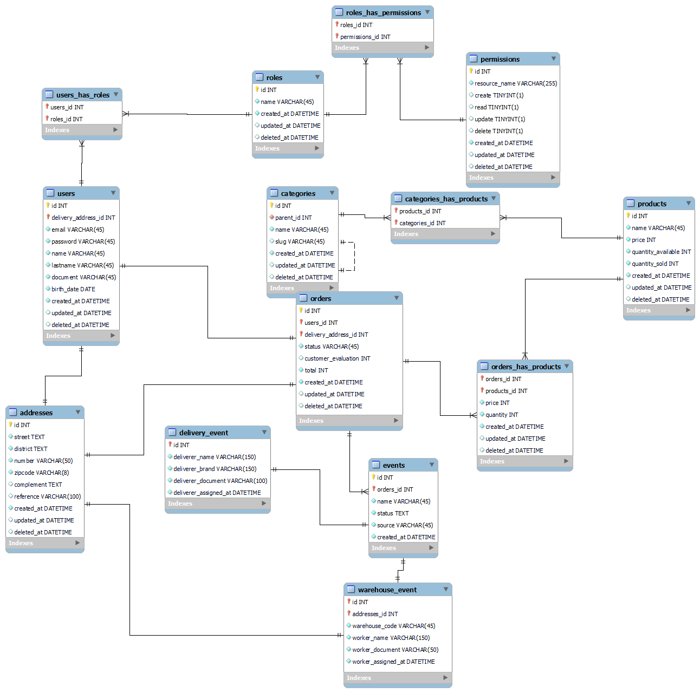
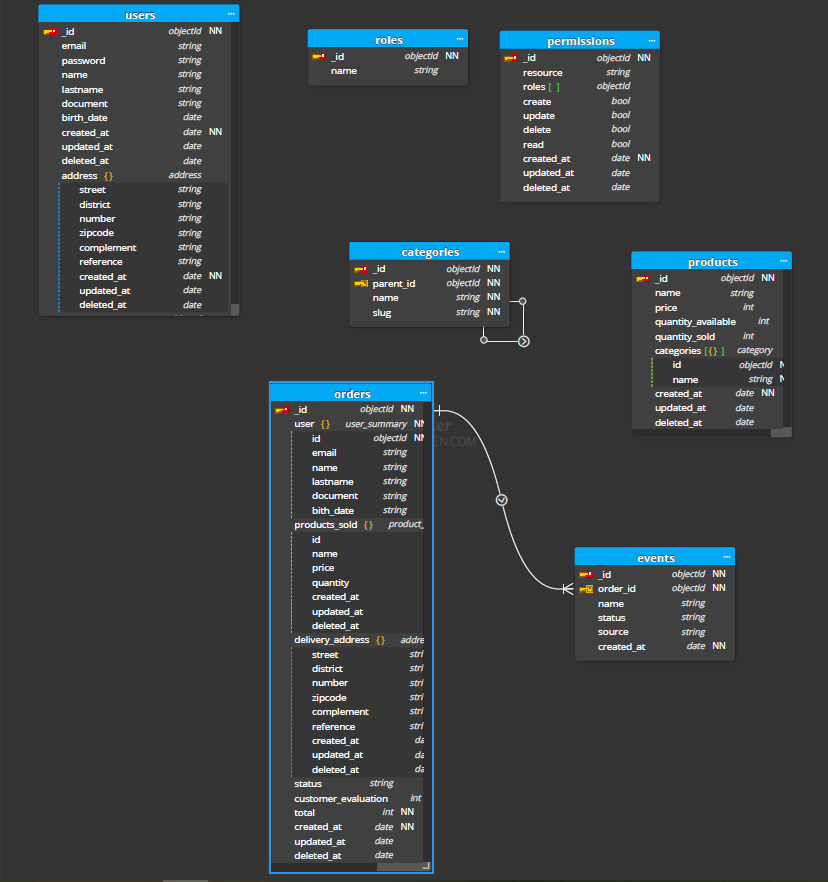

# Esperto Bots

## Descrição
O EspertoBots consiste no backend de um e-commerce de robôs inteligentes que auxiliam o dia-dia das pessoas, por motivo de simplicidade a aplicação irá ignorar questões financeiras e outras questões administrativas, permitindo o fluxo de autenticação (usuário comum/ ou admin), e os fluxos de CRUD das entidades de Categoria, Produtos, Eventos e Pedidos.  

### **A aplicação deve permitir:**

#### Autenticação
- autenticar usuários
- checar se um usuário tem permissão a uma ação especifica de um recurso (Categoria, Produto, Pedido, ...)

#### Categorias (APENAS ADMIN)
- criar/editar/remover categoria 
- listar categorias
- listar subcategorias de uma categoria

#### Produtos (APENAS ADMIN)
- criar/editar/remover produtos 
- listar os produtos 
- filtrar eles por categoria 

#### Pedidos (ADMIN PODE EFETUAR TODAS AS OPERAÇÕES)
- criar/editar/remover pedido (usuário comum pode apenas criar)
- listar os pedidos (usuário comum pode apenas listar seus pedidos) 
- listar os produtos de um pedido (usuário comum pode apenas listar os produtos do seu pedido)  
- listar os eventos de um pedido ("foi para a montagem", "saiu para entrega", "entregue") (usuário comum pode apenas listar os eventos do seu pedido)

> Todas as listagens da aplicação devem possuir paginação

## Objetivo
Essa aplicação tem como objetivo demonstrar um caso de uso prático de migração de um banco relacional (Mysql) para um não relacional (MongoDB), permitindo a comparação de perfomance e modelagem entre ambos os tipos de bancos de dados, sem afetar as diferentes funcionalidades que a aplicação disponibiliza.

## Esquemas

Esquemas utilizados para a especificação da aplicação

### **Modelo ER (EM ANDAMENTO)**
	

### **Descrição das coleções do Mongo (EM ANDAMENTO)**
